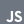
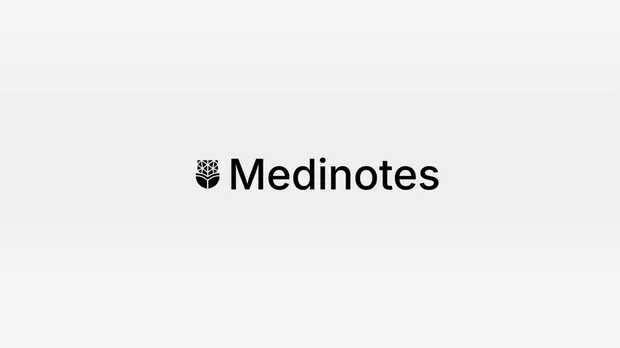

 

 &nbsp;&nbsp;
 &nbsp;&nbsp;
 &nbsp;&nbsp;

 

> CS student at Medi-Caps University, Indore. 
> Small, sharp tools over big vague ideas.

I build fast, test on real users, and ship what works. Right now that's 
[medinotes.in](https://medinotes.in) — a platform for students to access notes, PYQs, and AI-powered study tools.

   &nbsp;&nbsp;
   &nbsp;&nbsp;
   &nbsp;&nbsp;
   &nbsp;&nbsp;
   &nbsp;&nbsp;
   &nbsp;&nbsp;
   &nbsp;&nbsp;
   &nbsp;&nbsp;
   &nbsp;&nbsp;
   &nbsp;&nbsp;
   &nbsp;&nbsp;
  

**[medinotes.in](https://medinotes.in)**  ·  <samp>WEB, AI</samp> 
A platform for university students to access notes, previous year questions (PYQs), and AI study tools.

 

**[PROJECT 2](https://github.com/YOUR-USERNAME/PROJECT-2)**  ·  <samp>TECH 1, TECH 2</samp> 
[Short description of project 2. What does it do?]

**[PROJECT 3](https://github.com/YOUR-USERNAME/PROJECT-3)**  ·  <samp>TECH 1, TECH 2</samp> 
[Short description of project 3. What does it do?]

**[PROJECT 4](https://github.com/YOUR-USERNAME/PROJECT-4)**  ·  <samp>TECH 1, TECH 2</samp> 
[Short description of project 4. What does it do?]

Every graphic here is generated, not embedded from anyone else's server. 
`ascii.svg` is a photo pushed through a character ramp by 
[`scripts/make_portrait.py`](scripts/make_portrait.py); the stat graphics and 
these section headings are generated from GitHub data.

They animate with SMIL inside the SVG, because GitHub strips scripts from 
READMEs. Nothing here needs a third-party stats service.

The typeface is [YOUR FONT / TYPEFACE]. 
[Add anything interesting about how you built the profile here.]

[Add any final note, quote, currently-learning section, or contact information here.]
